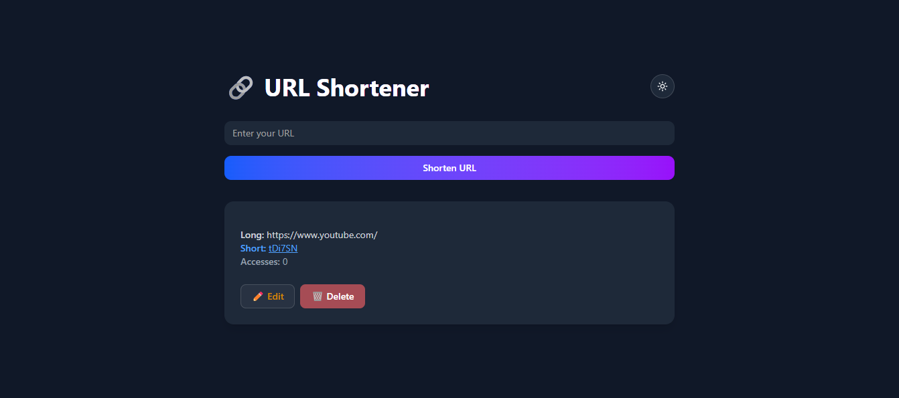

# 🔗 URL Shortener

A simple and functional URL shortener built using the **MERN stack**:  
**MongoDB**, **Express**, **React**, and **Node.js** with TypeScript and TailwindCSS.

## 📌 Features

- Shorten long URLs
- View all shortened URLs with:
  - Original URL
  - Short URL
  - Access count
  - Update/Delete options
- Access statistics for each short URL
- Instant redirection from short URL to original URL

## 🛠️ Tech Stack

**Frontend**

- React + TypeScript
- Tailwind CSS
- Axios
- Vite

**Backend**

- Node.js + Express.js
- MongoDB (Mongoose)
- nanoid (for generating short codes)
- CORS + dotenv

---

## How to Run Locally

### 1. Clone the Repository

    git clone https://github.com/fatimamjk/fatima-innovaxel-mustafa.git
    cd fatima-innovaxel-mustafa

### 2. Setup Backend

    cd backend
    npm install

### 3. Create a .env file and add following

    DATABASE_URL=your_mongodb_connection_url
    PORT=3000

### 4. Start backend server

    node index.js

### 5. Setup Frontend (in a new terminal/)

    cd ../frontend
    npm install

### 6. Start the frontend development server

    npm run dev

## 🔍 Frontend Preview

Here’s how the frontend of the URL Shortener looks:

